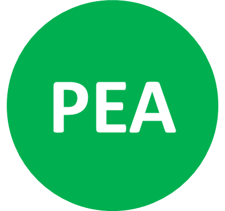

# GreenPea Project

> [greenpea project in 2 sentences]

## Project Structure
This repo consists of the following projects:

* webserver-iot:  Node.js webserver that connects to LoraWan devices through 'the Things Network'
* webserver-rest: 
* web-app admin (planned): Angular2 webapp to control LoraWan devices
* web-app client (planned): Angular2 webapp to display detailed energy usage and supply data including energy-source data.

## Tech
The webserver projects require [Node.js](https://nodejs.org/) v4+ to run.

### Repo Installation
See corresponding sub-repo for installation instructions of each project

License
----

--

